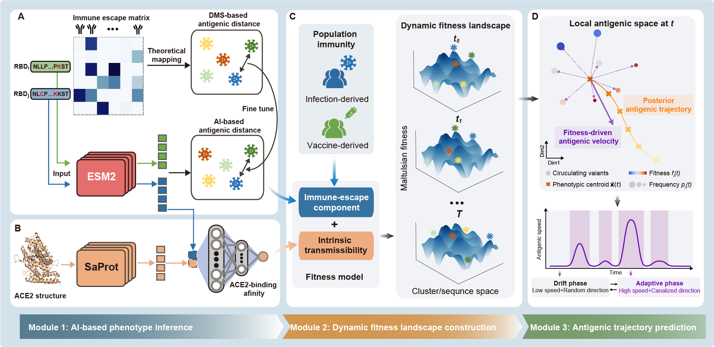

# vTRACE
## Project description
This repository contains the main analysis notebooks for **vTRACE** (*Viral Trajectory-based Antigenic Representation and Evolutionary Analysis*),  an integrated framework for analyzing viral evolution in complex adaptive landscapes by coupling AI-based phenotype inference with dynamic evolutionary modeling. It forms an encode–decode pipeline that links sequence variation to population-level evolutionary trajectories through three interconnected modules.

**Module I: AI-based phenotypic inference.** Viral RBD sequences are mapped to two key fitness-related phenotypes: antigenic distance, which captures immune escape potential, and ACE2-binding affinity, which serves as a proxy for intrinsic transmissibility. Antigenic distance is inferred by EvoRBD, a fine-tuned protein language model trained on transformed deep mutational scanning data, whereas ACE2-binding affinity is predicted using a transfer-learning model that combines EvoRBD embeddings with ACE2 structural representations.

**Module II: Dynamic fitness landscape reconstruction.** These phenotypes are integrated with genomic surveillance, case proxies, and vaccination history to reconstruct time-dependent viral fitness landscapes. Antigenic distance contributes an immune-selection component shaped by accumulated infection- and vaccine-derived immunity, whereas ACE2-binding affinity contributes an intrinsic transmissibility component. vTRACE models fitness at both the antigenic-cluster level and the individual-sequence level.

**Module III: Trajectory prediction in antigenic space.** Sequence-level fitness is then converted into predicted movement in local antigenic space. At each time point, circulating variants are embedded into a local antigenic space, and their fitness values are aggregated into an **antigenic velocity** that quantifies both the speed and direction of population-level antigenic change. This enables identification of drift versus adaptive phases and provides a basis for predicting short-term antigenic trajectories.

Below are the main analysis notebooks implementing this workflow.
## Environment Setup
We provide the `vTRACE` conda environment. You can build it using the following command:
```text
conda env create -f environment.yml
```
```text
conda activate vTRACE`
```

## Downloading model weights and precomputed data

The required files are available from our Hugging Face repository:

https://huggingface.co/LinZhang-PKU/vTRACE/tree/main

### Files required for `0_AI_phenotype_inference.ipynb`

To run the phenotype-inference notebook, download the following model weights and place them in:

`./phenotype_inference/model_trained/`

Required files:

* `ace2binding_trained.pth`
* `evoRBD_ba5_trained.pth`
* `evoRBD_wt_trained.pth`

Also download the entire `saprot_model` folder and the `foldseek` executable, and place them in:

`./phenotype_inference/code/ace2_binding_prediction/configs/`

These files are only required for `0_AI_phenotype_inference.ipynb`. This notebook may be skipped because the precomputed phenotype results used in the downstream analyses are provided separately.

### File required for downstream analyses

Download:

* `filtered_mutant_ad_mix.parquet`
* `filtered_mutant_counts_whole_world_mix.parquet`

and place them in: `./data/`  

`filtered_mutant_ad_mix.parquet` contains the precomputed pairwise antigenic distances, while `filtered_mutant_counts_whole_world_mix.parquet` contains the daily counts of RBD mutants used in the downstream analyses.


## Contents

### `0_AI_phenotype_inference.ipynb`

Predicts ACE2-binding affinity and pairwise antigenic distances from RBD sequences and evaluates model performance on external validation datasets.

This notebook requires the model weights and supporting files described above. It can be skipped when running the downstream analyses because precomputed results for the real-world RBD sequences are provided.

### `1_antigenic_cluster.ipynb`

Shows the precomputed global antigenic map and antigenic clusters built from EvoRBD-predicted pairwise antigenic distances between real-world SARS-CoV-2 sequences. It also computes cluster-to-cluster antigenic distances, average ACE2-binding per cluster, and temporal trends in antigenic distance and ACE2-binding. In addition, it prepares cluster-level frequency trajectories for downstream fitness modeling.

### `2_cluster_level_fitness_model.ipynb`

Builds a dynamic fitness model at the antigenic-cluster level. Using antigenic cluster frequencies, cluster-level antigenic distances, ACE2-binding estimates, case proxies, and vaccination data, it reconstructs infection- and vaccine-derived immune pressure, fits the fitness model, and compares predicted versus empirical cluster fitness in training and test periods.

### `3_sequence_level_fitness_antigenic_velocity.ipynb`

Extends the analysis from clusters to individual sequences. Using sequence-level antigenic distances, sequence frequency trajectories, and fitted immune-selection parameters from the cluster-level model, it computes sequence-level fitness and compares predicted and observed short-term spread. It then uses sequence-level fitness to predict evolutionary trajectories in antigenic space by first constructing local antigenic spaces and then deriving antigenic velocity to quantify both the speed and direction of population movement in antigenic space, thereby identifying periods of drift versus rapid adaptive change.

### `4_sensitivity_analysis.ipynb`

Performs robustness analyses for the antigenic-velocity framework. By perturbing key model parameters, it recalculates sequence-level fitness and antigenic velocity and evaluates whether the main conclusions on pulsed antigenic evolution and directional predictability remain stable.
